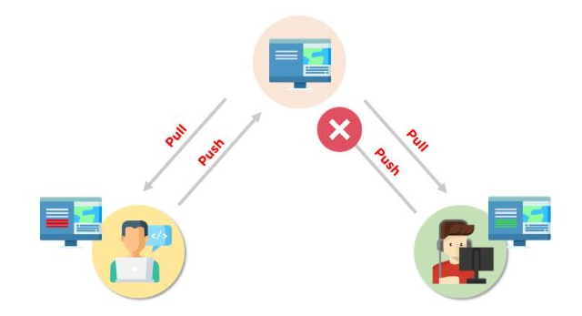

---


|  Test   | Description   |
| :---         |     :---      |
| NorthFoolish| Novice developer way to connect
| NorthReadProducts_Bad | Pro method with failure
|NorthReadProducts_Good| Pro method without failure


# March 4<sup>th</sup> Merge conflict

Intention is to mimic two developers working on the same project/solution where both take slightly different approached to complete a task while although slightly different will when pushed to a GitHub repository will cause merge conflicts[^1] which must be resolved using Visual Studio's `merge editor`.

|  <!-- -->   | <!-- -->   |
| -------------   | ------------- |
|   | Fetch[^3] is your friend, always perform a fetch before working on your code and talk with other developers working on the same project to avoid merge conflicts.  |


In one copy of LearnGit solution (located in LearnGit while the second is under LearnGitClone) the base code is to place a time-out on an attempt to open a connection to a SQL-Server instance followed by running a SELECT statement which returns a container shown below.

```csharp
public class DataTableResults
{
    public DataTable DataTable { get; set; }
    public bool ConnectionFailed { get; set; }
    public string ExceptionMessage { get; set; }
    public Exception GeneralException { get; set; }
    public bool HasException => ConnectionFailed || GeneralException != null;
}
```

The code is wrapped in a try-catch, on any run-time exceptions an in-house log library is used to record issues. There are two types of expected exceptions

Time-out on a bad connection of type [TaskCanceledException](https://docs.microsoft.com/en-us/dotnet/api/system.threading.tasks.taskcanceledexception?view=net-6.0) for a connection timeout and [Exception](https://docs.microsoft.com/en-us/dotnet/api/system.exception?view=net-6.0) for general runtime errors such as malformed query.

Both exceptions in this case are lumped together in a single try-catch.


In the clone version, rather than a container (DataTableResults) for returning information a Tuple is used as per below.

```csharp
Task<(DataTable dt, bool)>
```

The Try-catch differs by having two catches.

```csharp
try
{
   ...
}
catch (TaskCanceledException tce)
{
   ...
}
catch (Exception localException)
{
   ... 
}
```

Next up, a free third party library is used for logging known as [NLog](https://github.com/NLog) which introduced a good deal more code including a configuration file[^2] nLog.config.

# Unrehearsed

Karen will perform a merge conflict which has not be done beforehand to test if everything will work as intended. With that in mind anything is possible in regards to failure and/or success.


[^1]: Conflicts generally arise when two people have changed the same lines in a file, or if one developer deleted a file while another developer was modifying it. In these cases, Git cannot automatically determine what is correct. Conflicts only affect the developer conducting the merge, the rest of the team is unaware of the conflict. Git will mark the file as being conflicted and halt the merging process. It is then the developers' responsibility to resolve the conflict.

[^2]: NLog configuration file sample
```xml
<?xml version="1.0" encoding="utf-8" ?>
<!-- XSD manual extracted from package NLog.Schema: https://www.nuget.org/packages/NLog.Schema-->
<nlog xmlns="http://www.nlog-project.org/schemas/NLog.xsd" xsi:schemaLocation="NLog NLog.xsd" xmlns:xsi="http://www.w3.org/2001/XMLSchema-instance" autoReload="true" >

	<!-- the targets to write to -->
	<targets>

		<target xsi:type="File" name="development" fileName="${basedir}/Logs/DevLogFile.txt"
		        layout="${date}|${level:uppercase=true}|${message} ${exception}|${logger}|${all-event-properties}" />

		<target xsi:type="File" name="staging" fileName="${basedir}/Logs/StagingLogFile.txt"
		        layout="${date}|${level:uppercase=true}|${message} ${exception}|${logger}|${all-event-properties}" />

		<target xsi:type="File" name="production" fileName="${basedir}/Logs/ProductionLogFile.txt"
				layout="${date}|${level:uppercase=true}|${message} ${exception}|${logger}|${all-event-properties}" />

		<!-- Sample for CSV format -->
		<target xsi:type="File" name="testing" fileName="${basedir}/Logs/Log-${date:format=yyyy-MM-dd}.csv">
			<layout xsi:type="CsvLayout">
				<column name="Index" layout="${counter}" />
				<column name="ThreadID" layout="${threadid}" />
				<column name="Time" layout="${longdate}" />
				<column name="Severity" layout="${level:uppercase=true}" />
				<column name="Location" layout="${callsite:className=False:fileName=True:includeSourcePath=False:methodName=False}" />
				<column name="Detail" layout="${message}" />
				<column name="Exception" layout="${exception:format=ToString}" />
			</layout>
		</target>


		<!-- write to console-->
		<target xsi:type="Console" name="target2" layout="${date}|${level:uppercase=true}|${message} ${exception}|${logger}|${all-event-properties}" />
	</targets>

	<!-- rules to map from logger name to target -->
	<rules>
		<!--<logger name="*" minlevel="Fatal" writeTo="production" />-->
		<logger name="*" minlevel="Trace" writeTo="testing" />

	</rules>
</nlog>
```
[^3]: The git fetch command downloads commits, files, and refs from a remote repository into your local repo. Fetching is what you do when you want to see what everybody else has been working on. It’s similar to svn update in that it lets you see how the central history has progressed, but it doesn’t force you to actually merge the changes into your repository. Git isolates fetched content from existing local content; it has absolutely no effect on your local development work. 